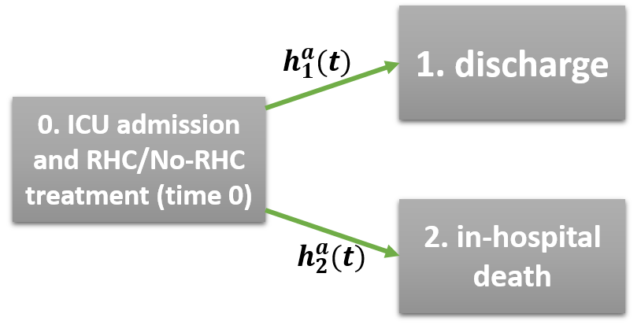

The `causalCmprsk` package accompanies the paper of @ADmet and is designed for estimation of average treatment effects (ATE) of two static treatment regimes on time-to-event outcomes with $K\geq 1$ competing events.

# Why `causalCmprsk`?
***

- It implements both nonparametric estimation (based on the weighted Aalen-Johansen estimator) which does not assume any model for potential outcomes, and Cox-based estimation that relies on the proportional hazards assumption for potential outcomes.

- It provides three measures of treatment effect on time-to-event outcomes: **cause-specific hazard ratios** which are time-dependent measures under a nonparametric model, risk-based measures such as **cause-specific risk differences** and **cause-specific risk ratios**, and **restricted-mean-time differences** which quantify how much time on average was lost (or gained) due to treatment by some specified time point. Restricted-mean-time difference is an intuitive summary of treatment effects that translates the treatment effect from the probability (risk) into the time domain and allows to quantify, for example, by how many days or months the treatment speeds up the recovery or postpones death.

- It implements different weights representing different target populations. `ATE` and `stab.ATE` weights aim to estimate average treatment effects for the original population. `ATT` weights target average treatment effects for the population of treated, and `ATC` weights correspond to the population of untreated. `overlap` weights aim to estimate average treatment effects for the **overlap population**, that is the population with the largest equipose regarding the treatment. 

- It uses Bayesian bootstrap for estimation of uncertainty. Bayesian bootstrap is considered a more stable alternative to the simple bootstrap for time-to-event data. We implemented parallel computing to  speed up bootstrap replications.

- It can be used for a Randomized Controlled Trials setting when there is no need for emulation of baseline randomization, by using `unadj` option in functions `fit.nonpar` and `fit.cox`.

- It has a function `get.numAtRisk` returning the time-varying number-at-risk  for both "unadjusted" (raw) data, and "weighted" pseudo-population. The number-at-risk statistic can be used for diagnostics of extremely influential weights.

- Competing events can be dependent.

- Data can be right-censored.


# Right Heart Catheterization (RHC) data
***

We will illustrate how to use `causalCmprsk` package by analyzing data from an observational study on right heart catheterization (RHC) procedure. The data were obtained from http://biostat.mc.vanderbilt.edu/DataSets.

RHC data were collected by @Connors with the aim to evaluate the effectiveness and safety of RHC procedure for critically ill patients admitted to ICUs. The study of @Connors appeared to be influential since most of the physicians strongly believed in the benefits of RHC procedure, and therefore conducting a clinical trial to test RHC was unethical. @Connors collected an extensive set of covariates in order to adjust for treatment assignment bias, and their results showed that RHC might be harmful. Following that, this data set drew attention of many researchers, the data were multiply reanalyzed, for example, by @Lin, @Tan2006, @Zaslavsky, @Love, @Mao, @Tchetgen, among many others.

RHC data contain information on 5735 critically-ill patients who were considered for RHC procedure on their admission to an ICU. Out of 5735 patients, 2184 did RHC test and the remaining 3551 did not. The information on their baseline characteristics collected by @Connors is very rich.  The follow-up on their survival was long, with the maximum follow-up time of 5 years and 4 months.

The data were analyzed for different outcomes derived from the original data set. Initially, the interest was in 30-day survival following RHC procedure or a decision of not doing RHC with a binary indicator of 30-day survival. @Connors, @Zaslavsky and @Tchetgen used this binary outcome.  @Tan2006 used  a survival outcome with censoring at 30 days. 
@Mao analyzed data for the length-of-stay in an ICU, but without distinguishing whether the end of the stay was due to discharge or in-hospital death, combining the two opposite causes of the end-of-stay into one. If a discharge from an ICU can be thought as a measure of clinical improvement, then combining two reasons for the end-of-stay into one composite endpoint might be meaningless.

In this vignette, we aim to reanalyze RHC data for the length-of-stay accounting for the reason of the end-of-stay in an ICU. We are interested to estimate the effects of RHC procedure on two competing outcomes, time to discharge and time to in-hospital death. 
The [competing risks analysis](#cmprsk) will provide better understanding of the effect of RHC procedure on overall stay in an ICU - we will compare our results to the findings of @Mao.

We will also analyze RHC data for [30-day survival](#survival30), regardless of whether a patient died while staying in an ICU or after the discharge. These results then will be compared to the results obtained by @Tan2006.


# Competing risks framework
***

## Notation and assumptions {#assumptions}

We will introduce the notation and the treatment effect estimands for RHC data example, where there are two causes of "discharge", due to improvement and due to death. That is the number of competing events $K=2$.

Let $T$ be the lag time from *the admission to an ICU and consideration for RHC procedure* to the **discharge** or **death in a hospital**, whichever comes first.
And let $E$ be an indicator of the type of the event, with $E=1$ if $T$ corresponds to discharge, and $E=2$ if $T$ corresponds to death. If neither discharge nor death is observed during the follow-up, $T$ is right-censored by the time to the last visit, and in this case $E=0$. In our length-of-stay analysis of RHC data, there is no censoring, and for all the patients (except for 1 person) the date of the end-of-stay in an ICU is known.

Let $A$ be the treatment assignment random variable with $A=1$ for those who had RHC procedure and $A=0$ for those who did not have, and $C$ be a vector of covariates.

Let $(T^a, E^a)$, $a=0,1$, be potential outcomes that would be observed if a patient would receive treatment $a$. Our **causal assumptions** are:

1.  **no unmeasured confounding**: treatment assignment $A$ is independent of potential outcomes given $C$. That is, given $C$, $A$ and $(T^0, E^0)$ are independent, and $A$ and $(T^1, E^1)$ are independent;

2. **positivity**: $0<P(A=a\mid C)<1$ for $a=0,1$;

3. **SUTVA (Stable Unit Treatment Value Assumption)**: the outcome of every patient does not depend on the treatment of others (noninterference), and the outcome does not depend on the way a treatment was assigned (consistency).

If there is right censoring in the data, our methods assume that given $A$, the time to the last visit (censoring time) is independent of the outcome $(T,E)$.


## Treatment effect estimands {#estimands}

In order to introduce treatment effect estimands, we need first to define single-world  cause-specific hazards of transitioning to states **"1. discharge"** or **"2. in-hospital death"**  (Figure \@ref(fig:fig1)) in a counterfactual world corresponding to treatment $a$:
$$
h_k^a(t)=\lim_{\Delta t \to 0} \frac{1}{\Delta t} P(t\leq T^a < t+\Delta t, E^a=k \mid T^a \geq t), \quad k=1,2,
$$
and single-world cause-specific cumulative incidence functions (CIF):
$$
CIF_a(t, k)=E\left[I_{(T^a \leq t, E^a=k)}\right]=P(T^a \leq t, E^a=k), \quad k=1,2.
$$

```{r  label= fig1, fig.cap="A single-world competing risks model with two events *discharge* and *in-hospital death*.", echo=FALSE, fig.align="center", out.width = "60%"}
    
```

Hazards $h_k^a(t)$ are usually interpreted as rates of the competing processes, and $CIF_a(t, k)$ are often called **risk** functions - see, e.g., @risk_rate and @cole2. For a more detailed definition of $CIF_a(t, k)$, we refer to @ADmet (Methods section).  


### Hazards ratios (HR), risk differences (RD) and risk ratios (RR)


The hazard ratios for both events are defined by
$$
	HR_k(t)=\frac{h_k^1(t)}{h_k^0(t)}, \quad k=1,2.
$$
Notice that here $HR_k(t)$ can depend on $t$ because we do not make any modeling assumptions regarding the hazard functions $h_k^a(t)$. 
	
The risk difference functions are defined by
$$
RD(t, k)=E\left[I_{(T^1 \leq t, E^1=k)}\right] - E\left[I_{(T^0 \leq t, E^0=k)}\right]= CIF_1(t, k) - CIF_0(t, k), \quad k=1,2.
$$
$RD(t,k)$ are between-treatment-arms differences of probabilities of having an event of type $k$ by time $t$. They represent the average treatment effects on different types of events, for the target population.
The risk ratios, respectively, are defined by
$$
RR(t, k)=\frac{E\left[I_{(T^1 \leq t, E^1=k)}\right]}{E\left[I_{(T^0 \leq t, E^0=k)}\right]}= \frac{CIF_1(t, k)}{CIF_0(t, k)}, \quad k=1,2.
$$


### Restricted mean time (RMT) gained/lost due to treatment

If we want to quantify the effect of treatment in terms of the number of days/months/years gained (or lost) on average from being treated, we can "translate" $CIF_a(t, k)$ from probabilities to the time domain by using the following Restricted Mean Time functionals $RMT_a(\tau, k)$  which are defined by $$
RMT_a(\tau, k) = \int_0^{\tau} CIF_a(t,k)dt, \quad k=1,2, \quad a=0,1,
$$
where $\tau$ is some prespecified time point of interest, e.g. 5 years. $RMT_a(\tau, k)$ is the area under the CIF curve, which can be interpreted as the restricted average post-event time corresponding to event $k$. If the event is desirable, we would like to see a longer average post-event time. For example, for recovery we would like patients to recover faster which would result in a longer average time in recovery - see, e.g., @Zack. 
Notice  that $RMT_a(\tau, k)$, $k=1,2$, are cause-specific functionals that correspond to event $k$.
The **average treatment effect based on RMT** can be defined as a difference: 
$$
RMT_1(\tau, k)-RMT_0(\tau, k).
$$ 

Use of the RMT for quantifying treatment effects is becoming more established in the univariate survival analysis, where this effect is usually defined as a difference between the Restricted Mean **Survival Times** (RMST) which is defined by 
$$
RMST_a(\tau) = E(T^a I(T^a \leq \tau)),
$$
that is the expectation of the restricted time-to-event. However, in competing risks, the RMT is still very rarely used. Two recent papers of @Calkins and @Zack have the real data examples that illustrate the use  of the  RMT in the competing risks setting.


From the definition of the RMST, it is clear that it does not distinguish between the causes of the event, but only uses the information on the time-to-event. 
Alternatively, the RMST can be obtained as the area under the survival curve up to $\tau$. The RMST is interpreteted as the expected restricted sojourn time in state 0 (Figure \@ref(fig:fig1)).   

The relation between the RMST, used in the univariate survival analysis, and the cause-specific RMT, used in the competing risks analysis, can be seen from the following:
$$ 
RMST_a(\tau) = E(T^a I(T^a \leq \tau))= 
\int_0^{\tau} \left\{1- CIF_a(t,1) - CIF_a(t,2)\right\} dt =\\
\tau - \int_0^{\tau} CIF_a(t,1)dt - \int_0^{\tau}CIF_a(t,2) dt= 
\tau- RMT_a(\tau,1) - RMT_a(\tau,2). 
$$

That is, combined together the cause-specific $RMT_a(\tau, 1)$ and $RMT_a(\tau, 2)$ complement the Restricted Mean Survival Time, $RMST_a(\tau)$.


## Estimation

### Propensity scores (PS)


When we estimate the ATE from observational data where the treatment was not randomized, we need to account for the treatment assignment selection bias, e.g., through an **emulation of baseline randomization**. The goal of this emulation is to create similar treatment arms (at least with respect to measured baseline covariates). This can be achieved under the assumption of "no unmeasured confounding", e.g., by inverse-probability-of-treatment-weighting (IPTW) based on a treatment assignment model, or a propensity score (PS) model. A propensity score for an individual with observed treatment $A=a$ and a vector of covariates $C=c$, is defined by:
$$
ps=P(A=a \mid C=c).
$$
Further, we denote the estimates of $ps$ by $\widehat{ps}$.  

There are many considerations playing a role in: 

- choosing a PS model, 
- selection of variables to include in this model, 
- choosing appropriate balancing weights based on a fitted PS model, 
- model diagnostics, 
- and finally, taking into account the uncertainty resulting from a treatment assignment modeling step. 

The aim of the PS model is to balance covariates between treatment groups, and there were proposed several ways to achieve the balance. For example, @CBPS propose to fit a PS model while "optimizing the covariate balance", that is they combine the steps of *fitting a PS model* and *obtaining (optimal) balancing weights* into one procedure. 
In contrast to this method, we take a step-by-step approach where any part of the whole process of building PS weights can be replaced with its alternative, e.g., anothe typr of a PS model, or another type of weights. In what follows we address some (but not all) of the listed above considerations:


**(A)** A fitted PS model can be formally assessed for the goodness-of-fit (GOF) to the observed data using formal statistical tests, but this type of diagnostics is usually not done in practice. 
The reason for that is that the goal of the PS model is to balance baseline covariates, therefore the main criterion for **a good fit of the PS model** is usually the degree of achieved balance for important confounders. 
However, it is recognized that the balance cannot be attained with a poorly fitted PS model, and a flexible family of models for propensity scores is more likely to fit the data well.
<!--If the PS model fits the data well, the model-based predicted probabilities of treatment assignment will be close to the corresponding empirical probabilities. A flexible family of models for propensity scores is more likely to fit the data well. 

calibration of the propensity score model is important: the predicted
and empirical rates of treatment assignment should agree in relevant
subsets of the covariate space, or else covariate balance cannot be attained.
--> 

`causalCmprsk` uses logistic regression for the propensity scores model. All the factors provided by the user to the functions `get.weights`, `fit.nonpar` and `fit.cox` are included in the PS model, and no variable selection is implemented. The factors in the PS model can be main effects or interactions. Provided a PS model fits the data well and if there is no problem of [non-overlap](#overlap) between the treatment arms, the covariates will be **balanced** in the weighted population, meaning that the weighted marginal distributions will be similar in two treatment arms (if their main effects were included in the PS model), and the weighted joint distributions will be similar in both treatment arms as well (if their corresponding interactions were included in the PS model). 

The problem of non-overlap, though, can be overcome by choosing, e.g., *overlap weights* (@Zaslavsky, @fan_li_2, @overlap_jama).


**(B)**  For theoretical and practical considerations on confounder selection we refer to @Ding, @austin_stuart and @Tyler.  

Currently, `causalCmprsk` does not implement any confounder selection procedure, and all the factors provided by the user to the functions `get.weights`, `fit.nonpar` and `fit.cox` in the  argument `C` are included in the PS model. 
In general, we just remind that the process of variable selection in the PS model involves not  only a covariate-treatment relationship but also how strongly a covariate is related to the studied outcome, since only variables that are related to both the treatment assignment and the outcome are defined as confounders. The list of potential confounders should be screened by a subject matter expert to avoid inclusion of a possible instrumental variable (IV) in the PS model, since this might amplify the residual bias in the presence of unmeasured confounding or increase the variance if all the confounders are measured (@Ding). 


**(C)** It is important to diagnose a fitted PS model before we use it, since it is the basis for our inference on the average treatment effects. The importance of diagnostics of a fitted PS model is recognized by all the authors who use propensity scores, but by "the diagnostics of a PS model" they usually mean different procedures (@PS_diag).

For example, the standard statistical diagnostic test for the goodness-of-fit (GOF) of a logistic regression model, the Hosmer-Lemeshow test (@HL), is very rarely used for diagnostics of a PS model (@PS_diag).  Although it is important that the model-based predicted probabilities of treatment assignment are similar to the corresponding empirical probabilities (@Zaslavsky), most often a fitted PS model is assessed by its ability to balance baseline covariates which is verified by looking at the absolute standardized differences (ASD) (@austin_stuart, @PS_diag, @Zaslavsky, @overlap_jama). For continuous covariates, it is even more informative to compare (at least visually) the distributions of weighted covariates in two treatment groups, and not only their weighted averages or ASD.

Moreover, we notice that given the same PS model, the attained covariate balance depends on the type of weights we choose. For example, "overlap weights estimated from a logistic model yield exact balance between groups in the means of each covariate included in the model" (@Zaslavsky).


In order to diagnose a fitted PS model and check the resulting covariate balance, we recommend to call first `get.weights` function, which can be done externally, before any estimation of ATEs is done. 
Through the analysis of RHC data, we will illustrate how to [visually verify whether the PS model fits the data well](#GOF), [check overlap](#overlap) and [evaluate the attained balance](#balance).


**(D)**  The choice of weights plays a crucial role in the estimation of average treatment effects, since weights define the **target population** for which we estimate the ATE. "The ATE targets just one patient mix among many possible patient mixes. With heterogeneous treatment effects, different patient mixes lead to different estimands" (@mao_li). 

`causalCmprsk` has the following types of weights (`wtype`) which correspond to different target populations and thus to different ATEs: 

1. **"ATE"**, defined by $\frac{1}{\widehat{P}(A=a_i\mid  C=c_i)}$, corresponds to the ATE for the overall cohort;
2. **"stab.ATE"**, defined by $\frac{\widehat{P}(A=a_i)}{\widehat{P}(A=a_i\mid C=c_i)}$, is a stabilized version of ATE weights (@sw_hernan), so that "stab.ATE" corresponds to the ATE for the overall cohort;
3. **"ATT"**,  defined by $\frac{\widehat{P}(A=1\mid C=c_i)}{\widehat{P}(A=a_i\mid C=c_i)}$, corresponds to the ATE for the population of treated;
4. **"ATC"**, defined by $\frac{\widehat{P}(A=0\mid C=c_i)}{\widehat{P}(A=a_i\mid C=c_i)}$, corresponds to the ATE for the population of untreated (i.e. a control group);
5. **"overlap"**, defined by $\frac{\widehat{P}(A=1\mid C=c_i)\widehat{P}(A=0\mid C=c_i)}{\widehat{P}(A=a_i\mid C=c_i)}$, corresponds to the ATE for the overlap population. Please see Table 1 in @Zaslavsky. 

The important point to remember is that if the treatment has heterogeneous effects for different individuals, the different weighting schemes target different population average effects, and it is  important to characterize this target population (@target_pop), e.g., to describe covariate distributions of this target population. We will illustrate this in RHC data analysis [below](#target).


### Cox-based estimation {#coxbased}

`causalCmprsk` implements the Cox-based estimation by assuming the Cox proportional hazards model for the **single-world cause-specific hazards** $h^a_k(t)$, $k=1,2$:
$$
h_k^0(t)=h_{0k}(t); \quad h_k^1(t)=h_{0k}(t) \exp(\beta_k), \quad k=1,2.
$$
This model assumes that the cause-specific hazards are proportional in two counterfactual worlds, a world where everyone is treated and a world where everyone is not treated:
$$
HR_k(t)=\frac{h^1_k(t)}{h^0_k(t)}=\frac{h^0_k(t)\exp(\beta_k)}{h^0_k(t)}=\exp(\beta_k)=HR_k,
$$
and a proportionality factor between them is $\exp(\beta_k)$. This outcome model implies time-invariant hazard ratios, $HR_k$.  

The balancing weights that aim to adjust for the treatment assignment selection bias, play a role of "case weights" where the contribution of each observation is $w_i$ instead of 1. For more details on the implemented Cox-based estimation, and for the explicit expressions of the estimating equations and the estimators we refer to @ADmet (Methods section).


### Nonparametric estimation

In nonparametric survival framework, the single-world cause-specific hazards $h^0_k(t)$ and $h^1_k(t)$ ($k=1,2$) stay unspecified, that is $h^0_k(t)$ and $h^1_k(t)$ freely vary and are not tied together by any assumptions. 
This implies that now $HR_k(t)$ can be time-dependent. The nonparametric estimates provide a visual way to test the Cox proportional hazards assumption (under our [causal assumptions 1,2,3](#assumptions)). We illustrate how to do this in RHC data analysis [below](#checkPH).

The nonparametric estimation procedure comprises: first, the estimation of all single-world cause-specific cumulative hazard functions, $H^a_k(t)=\int_0^t h^a_k(s) ds$, $k=1,2$, $a=0,1$, and second, using them as "building blocks" to derive the estimators of all other parameters:

1. The estimator of the cumulative hazards $H^a_k(t)$ is a weighted version of the Breslow-type estimator:
$$
	\widehat{H}^a_k(t)=\sum_{i: e_i=k, a_i=a} \frac{ \widehat{w}_i I(t_i\leq t)} { \sum_{j:a_j=a} \widehat{w}_j I(t_i\leq t_j)}, \quad k=1,2, \quad a=0,1.
$$
2. By plugging-in the estimated hazards, $\widehat{H}^a_k(t)$, we obtain the estimator of $CIF_a(t,k)$:
$$
\widehat{CIF}_a(t,k)=\sum_{i: e_i=k, a_i=a, t_i\leq t} \frac{ \widehat{w}_i \exp(-\widehat{H}^a_1(t_i) - \widehat{H}^a_2(t_i))} { \sum_{j:a_j=a} \widehat{w}_j I(t_i\leq t_j)}, \quad k=1,2, \quad a=0,1.
$$
3. The estimator of $RMT_a(t,k)$ is 
$$
\widehat{RMT}_a(\tau, k) = \int_0^{\tau} \widehat{CIF}_a(t,k)dt, \quad k=1,2, \quad a=0,1.
$$
4. Then, the estimators of the treatment effect measures, i.e. HR, RD, RR and RMT differences, are easily obtained by plugging-in.

Similar to the [Cox-based estimation](#coxbased), here too, the balancing weights are used as "case weights".

Notice that the resulting estimates of $H^a_k(t)$, $CIF_a(t,k)$ and of their functionals are $c\grave{a}dl\grave{a}g$ (right-continuous with left-limits) step functions. 
The estimates of $RMT_a(t,k)$ and its differences are not step functions. 


### Quantifying uncertainty

`causalCmprsk` uses Bayesian bootstrap to obtain confidence intervals (see, e.g., @Lo1993), where each bootstrap sample comprises the original cohort with a random weight, assigned to each observation. This weight is generated from $Exp(1)$ distribution, then truncated at 5, and lastly standardized so that the sum of all weights would equal the sample size. 

For each bootstrap sample, we repeat the steps of **1.** fitting the propensity scores model and obtaining balancing weights, and **2.** estimating all the parameters of interest, that is the absolute measures (i.e., cumulative hazards functions, CIFs and RMTs) and the treatment effect measures (i.e., HR, RD, RR, RMT differences).
This bootstrap estimator  takes into account the uncertainty that comes from both estimation of weights and estimation of the parameters of interest. 

All our parameters (except for $\beta_k$ under the Cox model) are time-dependent, and  their confidence intervals are obtained pointwise for each time point.  

In survival data, the Bayesian bootstrap is expected to provide a more stable alternative compared to the simple bootstrap  since the risk sets in all bootstrap samples change at the same time points as in the original cohort. The 95\% confidence intervals are obtained as 2.5\% and 97.5\% quantiles from the sample distributions of bootstrap estimates. 


# Analysis of RHC data
***

```{r cran_packages, echo=TRUE, include=TRUE, message=FALSE, warning=FALSE}
library(survival)
library(tidyverse)
library(ggalt) # for stepribbon
library(cobalt)
library(ggsci) # Nature Color palette
library(modEvA) # for H-L GOF test
library(naniar) # for exploring missingness 
library(knitr)
library(kableExtra)
library(summarytools)  
library(DT) 
library(Hmisc)

library(causalCmprsk)

opts_chunk$set(results = 'asis',      # Can also be set at the chunk-level
                comment = NA,
                prompt  = FALSE,
                cache   = FALSE)
st_options(plain.ascii = FALSE,        # Always use this option in Rmd documents
          style        = "rmarkdown",  # Always use this option in Rmd documents
          footnote     = NA,           # Makes html-rendered results more concise
          subtitle.emphasis = FALSE)   # Improves layout with some rmardown themes
```


## Reading, cleaning and preparing data

We follow the steps of @Love of reading, reformatting, reordering and cleaning RHC data:
```{r code1, echo=TRUE}
column_types_rhc <- 
  cols(urin1 = "d", meanbp1 = "d", resp1 = "d",
       swang1 = col_factor(c("No RHC", "RHC")),
       death = col_factor(c("No", "Yes")),
       sex = col_factor(c("Male", "Female")),
       cat1 = col_factor(c("ARF", "CHF", "Cirrhosis", "Colon Cancer", "Coma", "COPD",
                           "Lung Cancer", "MOSF w/Malignancy", "MOSF w/Sepsis")),
       # Cat1 - Primary disease category
       cat2 = col_factor(c("ARF", "CHF", "Cirrhosis", "Colon Cancer", "Coma", "COPD",
                           "Lung Cancer", "MOSF w/Malignancy", "MOSF w/Sepsis")),
       # Cat2 - Secondary disease category
       dnr1 = col_factor(c("No", "Yes")),
       card = col_factor(c("No", "Yes")),
       gastr = col_factor(c("No", "Yes")),
       hema = col_factor(c("No", "Yes")),
       meta = col_factor(c("No", "Yes")),
       neuro = col_factor(c("No", "Yes")),
       ortho = col_factor(c("No", "Yes")),
       renal = col_factor(c("No", "Yes")),
       resp = col_factor(c("No", "Yes")),
       seps = col_factor(c("No", "Yes")),
       trauma = col_factor(c("No", "Yes")),
       income = col_factor(c("Under $11k", "$11-$25k", "$25-$50k", "> $50k")),
       ninsclas = col_factor(c("Private", "Private & Medicare", "Medicare", 
                               "Medicare & Medicaid", "Medicaid", "No insurance")),
       race = col_factor(c("white", "black", "other")),
       ca = col_factor(c("No", "Yes", "Metastatic"))
  )
suppressWarnings(rhc_raw <- read_csv("http://biostat.mc.vanderbilt.edu/wiki/pub/Main/DataSets/rhc.csv", 
                    col_types = column_types_rhc))
```
We will not use variables `adld3p` and `urin1` due to the high percent of missing values:
```{r}
miss.report <- rhc_raw %>% miss_var_summary()
kable(miss.report[1:10,]) %>%
 kable_styling(bootstrap_options = "striped", full_width = F)
```

We create dummy variables by breaking up all categorical covariates into sets of binary indicators. We add the time-to-event variable, `T`, and the type-of-event variable, `E` which takes `1` for `"discharge alive"` and 2 for `"in-hospital death"`:
```{r}
rhc_cleaning1 <- rhc_raw %>%
  mutate(RHC = as.numeric(swang1 == "RHC"), 
         trt=swang1,
         E = ifelse(is.na(dthdte), 1, ifelse(dschdte==dthdte, 2, 1)), 
         T = dschdte - sadmdte,
         T.death = ifelse(is.na(dthdte), lstctdte - sadmdte, dthdte - sadmdte), # censored time to death
         D = ifelse(death =="No", 0, 1), # death indicator
         sex_Male = as.numeric(sex == "Male"),
         race_black = as.numeric(race == "black"),
         race_other = as.numeric(race == "other"),
         income_11_25K = as.numeric(income == "$11-$25k"),
         income_25_50K = as.numeric(income == "$25-$50k"),
         income_50K = as.numeric(income == "> $50k"),
         ninsclas_Private_Medicare = as.numeric(ninsclas == "Private & Medicare"),
         ninsclas_Medicare = as.numeric(ninsclas == "Medicare"),
         ninsclas_Medicare_Medicaid = as.numeric(ninsclas == "Medicare & Medicaid"),
         ninsclas_Medicaid = as.numeric(ninsclas == "Medicaid"),
         ninsclas_No_Insurance = as.numeric(ninsclas == "No insurance"),
# combine cat1 with cat2, i.e the primary disease category with the secondary disease category:         
         cat_CHF = as.numeric(cat1 == "CHF" | (!is.na(cat2))&(cat2 == "CHF") ),
         cat_Cirrhosis = as.numeric(cat1 == "Cirrhosis" | (!is.na(cat2))&(cat2 == "Cirrhosis")),
         cat_Colon_Cancer = as.numeric(cat1 == "Colon Cancer" | (!is.na(cat2))&(cat2 == "Colon Cancer")),
         cat_Coma = as.numeric(cat1 == "Coma" | (!is.na(cat2))&(cat2 == "Coma")),
         cat_COPD = as.numeric(cat1 == "COPD" | (!is.na(cat2))&(cat2 == "COPD")),
         cat_Lung_Cancer = as.numeric(cat1 == "Lung Cancer" | (!is.na(cat2))&(cat2 == "Lung Cancer")),
         cat_MOSF_Malignancy = as.numeric(cat1 == "MOSF w/Malignancy" | (!is.na(cat2))&(cat2 == "MOSF w/Malignancy")),
         cat_MOSF_Sepsis = as.numeric(cat1 == "MOSF w/Sepsis" | (!is.na(cat2))&(cat2 == "MOSF w/Sepsis")),
         dnr1_Yes = as.numeric(dnr1 == "Yes"),
         card_Yes = as.numeric(card == "Yes"),
         gastr_Yes = as.numeric(gastr == "Yes"),
         hema_Yes = as.numeric(hema == "Yes"),
         meta_Yes = as.numeric(meta == "Yes"),
         neuro_Yes = as.numeric(neuro == "Yes"),
         ortho_Yes = as.numeric(ortho == "Yes"),
         renal_Yes = as.numeric(renal == "Yes"),
         resp_Yes = as.numeric(resp == "Yes"),
         seps_Yes = as.numeric(seps == "Yes"),
         trauma_Yes = as.numeric(trauma == "Yes"),
         ca_Yes = as.numeric(ca == "Yes"),
         ca_Metastatic = as.numeric(ca == "Metastatic")
  )

# variables selection and data reordering:
rhc_full <- rhc_cleaning1 %>% 
  select(ptid, RHC, trt, T, T.death, E, D, sex_Male, 
         age, edu, race_black, race_other, income_11_25K, income_25_50K, income_50K,
         ninsclas_Private_Medicare, ninsclas_Medicare, ninsclas_Medicare_Medicaid,
         ninsclas_Medicaid, ninsclas_No_Insurance, 
         cat_CHF, cat_Cirrhosis, cat_Colon_Cancer, cat_Coma, cat_COPD, cat_Lung_Cancer, 
         cat_MOSF_Malignancy, cat_MOSF_Sepsis,
         # diagnoses:
         dnr1_Yes, card_Yes, gastr_Yes, hema_Yes, meta_Yes, neuro_Yes, ortho_Yes, renal_Yes, 
         resp_Yes, seps_Yes, trauma_Yes,
         ca_Yes, ca_Metastatic,
         # lab tests:
         wtkilo1, hrt1, meanbp1, resp1, temp1,
         aps1, das2d3pc, scoma1, 
         surv2md1, alb1, bili1, crea1, hema1, paco21, 
         pafi1, ph1, pot1, sod1, wblc1,
         # all variables with "hx" are preexisting conditions: 
         amihx, cardiohx, chfhx, chrpulhx, dementhx, 
         gibledhx, immunhx, liverhx, malighx, psychhx, 
         renalhx, transhx, 
         death, sadmdte, dschdte, dthdte, lstctdte)
```

There is one observation with a missing discharge date but a known date of death. That is its length-of-stay is interval-censored, therefore we will remove this observation from the analysis of the length-of-stay, but will include it in the analysis of 30-day survival. We will add two variables to the `rhc_full` dataset, `T.death` which is the time-to-death censored at 30 days, and a corresponding censoring indicator, `D.30`. 
```{r}
# omit 1 obs with missing discharge date for the length-of-stay analysis:
rhc <- rhc_full[!is.na(rhc_raw$dschdte),]
rhc_full$T.death.30 <- pmin(30, rhc_full$T.death)
rhc_full$D.30 <- ifelse(rhc_full$T.death <=30, 1, 0)
```
In summary, we will use `rhc` dataset in our analysis of length-of-stay, and `rhc_full` dataset in the analysis of 30-day survival. The original data set `rhc_full` has `` `r nrow(rhc_full)` `` observations. Out of them `` `r sum(rhc_full$D)` `` died during the follow-up,  and `` `r sum(rhc$E==2)` `` from them died while staying in the hospital. There are `` `r sum(rhc$E==1)` `` patients who discharged alive. 


The number of events of each type in the length-of-stay analysis is:
```{r, echo=TRUE}
E <- as.factor(rhc$E)
levels(E) <- c("discharge", "in-hospital death")
t <- addmargins(table(E, useNA="no"))
kable(t) %>% kable_styling(bootstrap_options = "striped", full_width = F)
```

The number of deaths over the follow-up:
```{r, echo=TRUE}
D <- as.factor(rhc_full$D)
levels(D) <- c("censored", "died")
t <- addmargins(table(D, useNA="no"))
kable(t) %>% kable_styling(bootstrap_options = "striped", full_width = F)
```

The number of deaths during the first 30 days following the admission to an ICU:
```{r, echo=TRUE}
D.30 <- as.factor(rhc_full$D.30)
levels(D.30) <- c("censored", "died")
t <- addmargins(table(D.30, useNA="no"))
kable(t) %>% kable_styling(bootstrap_options = "striped", full_width = F)
```

The numbers of patients in two treatment arms are:
```{r, echo=TRUE}
t <- addmargins(table(rhc_full$trt, useNA="no"))
kable(t) %>% kable_styling(bootstrap_options = "striped", full_width = F)
```


## Fitting PS model and its diagnostics

The previous analyses of RHC data showed that the distributions of covariates differ significantly across the treatment groups, therefore in order to make some causal conclusions we need to balance them. For the PS model, we used a logistic regression that includes the main effects of all available covariates, without any selection.

A list of covariates we included in the PS model is the following:
```{r}
covs.names <- c("age", "sex_Male", "edu", "race_black", "race_other",
                "income_11_25K", "income_25_50K", "income_50K", 
                "ninsclas_Private_Medicare", "ninsclas_Medicare", "ninsclas_Medicare_Medicaid",
                "ninsclas_Medicaid", "ninsclas_No_Insurance",
                "cat_CHF", "cat_Cirrhosis", "cat_Colon_Cancer", "cat_Coma", "cat_COPD", "cat_Lung_Cancer", 
                "cat_MOSF_Malignancy", "cat_MOSF_Sepsis", 
                "dnr1_Yes", "wtkilo1", "hrt1", "meanbp1", 
                "resp1", "temp1", 
                "card_Yes", "gastr_Yes", "hema_Yes", "meta_Yes", "neuro_Yes", "ortho_Yes", 
                "renal_Yes", "resp_Yes", "seps_Yes", "trauma_Yes", 
                "ca_Yes", "ca_Metastatic",
                "amihx", "cardiohx", "chfhx", "chrpulhx",
                "dementhx", "gibledhx", "immunhx", "liverhx", 
                "malighx", "psychhx", "renalhx", "transhx",
                "aps1", "das2d3pc", "scoma1", "surv2md1",
                "alb1", "bili1", "crea1", "hema1", "paco21", "pafi1", 
                "ph1", "pot1", "sod1", "wblc1")

```


### Testing goodness-of-fit of a PS model {#GOF}

We use `get.weights` function in order to fit a PS model and estimate weights. The input argument `wtype="stab.ATE"` requests calculation of stabilized ATE weights:
```{r}
ps.stab.ATE <- get.weights(df=rhc, A="RHC", C=covs.names, wtype = "stab.ATE") 
```
The estimated propensity scores are saved in the `ps` field of the output list `ps.stab.ATE`, and the `summary.glm` field returns the summary of the fitted logistic regression. The requested weights are saved in the `w` field.


We can verify the goodness-of-fit (GOF) of the treatment assignment model both graphically and using the formal test of @HL, where we check whether the model-based predicted probabilities of treatment assignment are similar to the corresponding empirical probabilities:
```{r, fig.align="center", fig.cap="Visual test of goodness-of-fit of a PS model and Hosmer-Lemeshow test.", fig.height=5, fig.width=5}
gof <- HLfit(obs=rhc$RHC, pred=ps.stab.ATE$ps, n.bins=50, bin.method = "quantiles", plot.bin.size=FALSE)
```
Ideally, all the points should fall on the diagonal line. 
In our example, as the Hosmer and Lemeshow's test shows, the logistic regression model with all the main effects does not fit the data well ($pvalue<0.001$), although visually the estimates fluctuate around the reference line. 


For comparison, if we omit all the covariates that are insignificant at the 0.05 level from the original model, the new model perfectly fits the data: 
```{r label=better, fig.align="center", fig.cap="Checking goodness-of-fit of a PS model with selection of significant covariates.", fig.height=5, fig.width=5}
ind <- ps.stab.ATE$summary.glm$coefficients[,4]<0.05
ps.stab.ATE.2 <- get.weights(df=rhc, A="RHC", C=covs.names[ind], wtype = "stab.ATE")
gof <- HLfit(obs=rhc$RHC, pred=ps.stab.ATE.2$ps, n.bins=50, bin.method = "quantiles", plot.bin.size=FALSE)
```

However, we notice that:

1. Although the omission of all insignificant covariates resulted in a better fit, using this selective model for weighting can leave the excluded covariates imbalanced, and moreover this might even distort the initially existing balance in them, as we can see further on Figure \@ref(fig:figcompare) which corresponds to the PS model with only significant covariates. The GOF criterion optimizes the loss function which does not necessarily goes along with balancing of important confounders.

2. Another potential "danger" of keeping only strong predictors of the treatment assingment in the PS model is an issue of possible bias amplification - see, for example, @Ding. 

In summary, a *good* PS model cannot be built based only on the covariates-"treatment assignment" relationship. It should incorporate extra knowledge on the covariates-outcome relationship and other aspects of the data generating processes.

In what follows, we will proceed with the PS model that includes all the available covariates.


### Checking overlap {#overlap}

In order to see whether there is a non-overlap problem, we compare the distributions of estimated propensity scores in two treatment groups:
```{r, fig.align="center", label=fig9, fig.cap="Checking overlap in PS distributions.", fig.height=5, fig.width=5}
rhc.ps <- rhc %>% mutate(ps = ps.stab.ATE$ps, stab.ATE.w = ps.stab.ATE$w)
ggplot(rhc.ps, aes(x = ps, fill = trt, color=trt)) +  geom_density(alpha = 0.5) + scale_fill_npg() + scale_color_npg()+ theme(plot.title = element_text(hjust = 0.5), legend.position = c(0.8, 0.8),
          legend.background=element_rect(fill="transparent"))
```
The plot reveals that the majority of patients who actually did not go through RHC procedure, had low (<0.5) propensities to get it. In general, there is no clear violation of overlap, and both groups appear near both edges of the support. However, this plot is not able to identify the strata responsible for the most extreme propensities. 
We will address this question [below](#target) by comparing between the overlap population and the original population mixes.


### Estimation of weights and balance diagnostics {#balance}

In order to evaluate the attained mean covariate balance after weighting we will look at the absolute standardized differences, ASD (@fan_li_2, @Zaslavsky, @mao_li). For continuous covariates, we will also inspect the weighted marginal distributions.

We will compare already estimated `stab.ATE` weights with the overlap weights, estimated by running:
```{r}
ps.overlap <- get.weights(df=rhc, A="RHC", C=covs.names, wtype = "overlap")
rhc.ps <- rhc.ps %>%   mutate(overlap.w = ps.overlap$w)
```

A convenient way to summarize all the ASD of three weights (`stab.ATE`, `overlap`  and  original unadjusted population) is the `love.plot` from the `cobalt` package (@cobalt): 
```{r, fig.align="center", label=fig10, fig.width=6.5, fig.height=8, message=FALSE, warning=FALSE, fig.cap="Testing covariate balance of the PS model with all covariates."}
#fig.asp=1.1, 
covs <- subset(rhc.ps, select = covs.names)
suppressWarnings(love.plot(RHC ~ covs, data=rhc.ps,
              weights = list(overlap=rhc.ps$overlap.w, stab.ATE=rhc.ps$stab.ATE.w), 
              threshold = .1, abs=TRUE, binary = "std", stars="raw", s.d.denom="pooled",
          var.order = "unadjusted",   
          title = "Comparing balancing weights") + scale_fill_npg() + scale_color_npg())
```
We follow the established convention that "a standardised difference of less than 0.1 can be considered as adequate balance" (@PS_diag). The stabilized ATE weighting resulted in good average balance, and overlap weights  estimated from a logistic regression, as expected, yielded exact average balance (@Zaslavsky).


For comparison, we inspect the balance attained by [a "better-fitted" PS model](#GOF) which omitted all insignificant covariates: 
```{r  figcompare, label=figcompare, fig.align="center", fig.width=6.5, fig.height=8,  message=FALSE, warning=FALSE, fig.cap="Testing covariate balance of the PS model with selection of significant covariates."}
ps.overlap.2 <- get.weights(df=rhc, A="RHC", C=covs.names[ind], wtype = "overlap")
rhc.ps <- rhc.ps %>% mutate(ps.2 = ps.stab.ATE.2$ps, stab.ATE.w.2 = ps.stab.ATE.2$w,
                         overlap.w.2 = ps.overlap.2$w)
covs <- subset(rhc.ps, select = covs.names)
suppressWarnings(love.plot(RHC ~ covs, data=rhc.ps,
              weights = list(overlap=rhc.ps$overlap.w.2, stab.ATE=rhc.ps$stab.ATE.w.2), 
              threshold = .1, abs=TRUE, binary = "std", stars="raw", s.d.denom="pooled",
          var.order = "unadjusted",   
          title = "Comparing balancing weights") + scale_fill_npg() + scale_color_npg())
```
Our conclusion is that the exclusion of insignificant variables from the PS model might result in disturbing the previously existing balance in some of those variables, without necessarily improving the balance in included covariates.


As an illustration of further balance diagnostics in continuous covariates, we chose two continuous variables with the least balance in the original population, and inspected  how the weights performed in balancing the whole distribution.  

For the APACHE score (`aps1` variable):
```{r, fig.align="center", out.width=c('33%', '33%', '34%'), fig.show='hold',  message=FALSE, warning=FALSE, fig.cap="Comparing distributions of `aps1` across two treatment arms for: (A) unadjusted, (B) stab.ATE, (C) overlap weights"}
rhc.ps$stab.ATE.w.1 <- rhc.ps$overlap.w.1<- rep(NA, nrow(rhc.ps))
rhc.ps$stab.ATE.w.1[rhc.ps$trt=="RHC"] <-
  rhc.ps$stab.ATE.w[rhc.ps$trt=="RHC"]/sum(rhc.ps$stab.ATE.w[rhc.ps$trt=="RHC"])
rhc.ps$stab.ATE.w.1[rhc.ps$trt=="No RHC"] <-
  rhc.ps$stab.ATE.w[rhc.ps$trt=="No RHC"]/sum(rhc.ps$stab.ATE.w[rhc.ps$trt=="No RHC"])
rhc.ps$overlap.w.1[rhc.ps$trt=="RHC"] <-
  rhc.ps$overlap.w[rhc.ps$trt=="RHC"]/sum(rhc.ps$overlap.w[rhc.ps$trt=="RHC"])
rhc.ps$overlap.w.1[rhc.ps$trt=="No RHC"] <-
  rhc.ps$overlap.w[rhc.ps$trt=="No RHC"]/sum(rhc.ps$overlap.w[rhc.ps$trt=="No RHC"])
ggplot(rhc.ps, aes(x = aps1, fill = trt, color=trt)) + ggtitle("A")+
  geom_density(alpha = 0.5) + scale_fill_npg() + scale_color_npg()+
  theme(plot.title = element_text(hjust = 0.5), legend.position = c(0.7, 0.7),
          legend.background=element_rect(fill="transparent"))
ggplot(rhc.ps, aes(x = aps1, fill = trt, color=trt, weight=stab.ATE.w.1)) + ggtitle("B")+ geom_density(alpha = 0.5) + scale_fill_npg() + scale_color_npg()+
  theme(plot.title = element_text(hjust = 0.5), legend.position = c(0.7, 0.7),
          legend.background=element_rect(fill="transparent"))
ggplot(rhc.ps, aes(x = aps1, fill = trt, color=trt, weight=overlap.w.1)) + ggtitle("C")+  geom_density(alpha = 0.5) + scale_fill_npg() + scale_color_npg()+
  theme(plot.title = element_text(hjust = 0.5), legend.position = c(0.7, 0.7),
          legend.background=element_rect(fill="transparent"))
```

For the mean blood pressure (`meanbp1` variable):
```{r, fig.align="center", out.width=c('33%', '33%', '34%'), message=FALSE, warning=FALSE, fig.cap="Comparing distributions of `meanbp1` across two treatment arms for: (A) unadjusted, (B) stab.ATE, (C) overlap weights", fig.show='hold'}
ggplot(rhc.ps, aes(x = meanbp1, fill = trt, color=trt)) + ggtitle("A")+
  geom_density(alpha = 0.5) + scale_fill_npg() + scale_color_npg()+
  theme(plot.title = element_text(hjust = 0.5), legend.position = c(0.7, 0.7),
          legend.background=element_rect(fill="transparent"))
ggplot(rhc.ps, aes(x = meanbp1, fill = trt, color=trt, weight=stab.ATE.w.1)) + ggtitle("B")+ geom_density(alpha = 0.5) + scale_fill_npg() + scale_color_npg()+
  theme(plot.title = element_text(hjust = 0.5), legend.position = c(0.7, 0.7),
          legend.background=element_rect(fill="transparent"))
ggplot(rhc.ps, aes(x = meanbp1, fill = trt, color=trt, weight=overlap.w.1)) + ggtitle("C")+  geom_density(alpha = 0.5) + scale_fill_npg() + scale_color_npg()+
  theme(plot.title = element_text(hjust = 0.5), legend.position = c(0.7, 0.7),
          legend.background=element_rect(fill="transparent"))
```

For both variables, the balance achieved by `stab.ATE` and `overlap` weights looks pretty adequate. 


### Characterizing the target population {#target}

It is very important to describe the baseline characteristics of the target population for which we are going to estimate the ATE, since it can help us to understand whether a pseudo-population created by weighting is clinically relevant and which randomized trial is best emulated by 
the chosen weights (@target_pop).
In Table \@ref(tab:table1) we summarize the marginal covariate distributions for three  populations: 

1. original (unweighted) population, 
2. the population created by `stab.ATE` weights and 
3. the overlap population

```{r, label=table1}
d <- rhc.ps[, covs.names]
add.names <- function(x, a) { paste(x,a, sep="")}
# original population:
descr.orig <- round( cbind( 
  apply(d, 2, wtd.mean, weights=rep(1, nrow(d))),
  sqrt(apply(d, 2, wtd.var, weights=rep(1, nrow(d)))), 
  t(apply(d, 2, wtd.quantile, weights=rep(1, nrow(d)), probs=c(.25, .5, .75)))
), dig=2)
descr.ATE <- round( cbind( 
  apply(d, 2, wtd.mean, weights=rhc.ps$stab.ATE.w),
  sqrt(apply(d, 2, wtd.var, weights=rhc.ps$stab.ATE.w)), 
  t(apply(d, 2, wtd.quantile, weights=rhc.ps$stab.ATE.w, probs=c(.25, .5, .75)))
), dig=2)
descr.overlap <- round( cbind( 
  apply(d, 2, wtd.mean, weights=rhc.ps$overlap.w),
  sqrt(apply(d, 2, wtd.var, weights=rhc.ps$overlap.w)), 
  t(apply(d, 2, wtd.quantile, weights=rhc.ps$overlap.w, probs=c(.25, .5, .75)))
), dig=2)
df3 <- data.frame(cbind(descr.orig, descr.ATE, descr.overlap))
row.names(df3) <- covs.names
names(df3) <- rep( c("mean", "sd", "q1", "med", "q3"), times=3)

kable(df3, caption="Comparing marginal distributions of covariates for three populations. q1, med and q3 correspond to 1st, 2nd and 3rd quartiles of a distribution.") %>%
  kable_styling(bootstrap_options = c("striped", "hover", "condensed", "responsive"), full_width = FALSE) %>%
   add_header_above(c("covariate "= 1, "original population" = 5, "stab.ATE population" = 5, "overlap population"=5)) %>%
  column_spec(2, background = "lightgrey") %>%
  column_spec(7, background = "lightgrey") %>%
  column_spec(12, background = "lightgrey") %>%  
     scroll_box(width = "100%", height = "500px")
```
There is not observed any significant difference between the target populations, both of which are similar to the original population.   
The `stab.ATE` weighting is expected to produce a population which is similar to the original population on average, with respect to covariates included in the PS model. In `stab.ATE` weighting no observation is excluded from the analysis, i.e. no weights are close to zero. But there could be possibly extremely influential observations with relatively high weights. Those are the observations that are rarely represented in their assigned treatment group. Figure \@ref(fig:ATEwdistr) shows the distributions of `stab.ATE` weights.

```{r  label=ATEwdistr, fig.height=5, fig.width=5, fig.align="center" ,  message=FALSE, warning=FALSE, fig.cap="Distribution of stab.ATE weights."}
ggplot(rhc.ps, aes(x = stab.ATE.w, fill = trt, color=trt)) +  
  geom_histogram(alpha = 0.4, bins=30) + scale_fill_npg() + scale_color_npg()+ theme(plot.title = element_text(hjust = 0.5), legend.position = c(0.8, 0.8),
          legend.background=element_rect(fill="transparent")) + ggtitle("Distribution of stab.ATE weights")
```

Table \@ref(tab:influential) lists observations with `stab.ATE` weights greater than 10, together with their overlap weights. Notice  that these observations have the highest overlap weights as well, but since overlap weights are bounded between 0 and 1, their influence in overlap weighting will be diminished. 

```{r, label=influential}
kable(rhc.ps[rhc.ps$stab.ATE.w>10, c("trt", "stab.ATE.w", "overlap.w", "ps")],
      caption="The list of most influential observations in the stab.ATE weighting.")
```
In the overlap weighting, the "influential" observations are defined in a different way from the `stab.ATE` weighting. If a person with covariates $C=c$ has high probability of being assigned to his actual treatment group, he would have low probability of appearing in the opposite group, meaning that if he would appear in the opposite group he would be highly influential. That is why, this "potentially influential" person will get a near 0 overlap weight in order to reduce his *potential* influence. Those *potentially influential* observations are different from those *actually influential* observations in `stab.ATE` weighting.  
Figure \@ref(fig:overlapdistr) shows the distributions of overlap weights.

```{r, label=overlapdistr, fig.height=5, fig.width=5, fig.align="center" ,  message=FALSE, warning=FALSE, fig.cap="Distribution of overlap weights."}
ggplot(rhc.ps, aes(x = overlap.w, fill = trt, color=trt)) +  
  geom_histogram(alpha = 0.4, bins=30) + scale_fill_npg() + scale_color_npg()+ theme(plot.title = element_text(hjust = 0.5), legend.position = c(0.8, 0.8),
          legend.background=element_rect(fill="transparent")) + ggtitle("Distribution of overlap weights")
```

We will base our final estimates on overlap weighting, since we did not see any striking difference between the original and the overlap populations, and because the overlap weights are expected to be more stable and efficient that `stab.ATE` weights (@Zaslavsky).


## Estimating the effect of RHC on the length-of-stay {#cmprsk}

After estimation and diagnostics of weights, we proceed with estimation of the ATE. 
We compare our results to the findings of @Mao, who estimated the ATE of RHC on the length-of-stay (LOS) in an ICU. This is a problematic composite outcome that combines two opposite processes, *discharge alive* and *in-hospital death* into one hard-to-interpret outcome. 

@Mao's approach assumes that the effect of RHC on the LOS is time-invariant. Their estimate of the ATE on the *log(LOS)*, based on overlap weights, is 0.094 (pvalue<0.001) meaning that RHC increases the *log(LOS)* by 0.094 time points.
In contrast to this finding, @Love shows that there is no significant difference between two treatments for this composite outcome. In these analyses, @Love uses RHC data for an illustration of different propensity score methods, and uses the HR as an effect measure.

Many other studies estimated the effect of RHC on mortality and consistently showed that "applying RHC leads to a higher mortality rate than not applying RHC." (see, e.g., @Zaslavsky)
 

In our analysis on RHC data, we aim to distinguish between the reasons of the end-of-stay in an ICU, and to allow for treatment effects to vary over time. Both these goals can be easily achieved with the `causalCmprsk` package. 


### Graphical test of a proportional hazards assumption {#checkPH}

Two main functions, `fit.cox` and `fit.nonpar`, take care of calling `get.weights` internally, and there is no need in running `get.weights` prior to `fit.cox` or `fit.nonpar`. 

We estimate all the [parameters](#estimands) using both nonparametric and Cox-based approaches, for both `stab.ATE` and overlap weights:

```{r}
# overlap weights========================:
# Nonparametric estimation:
res.overlap <- fit.nonpar(df=rhc, T="T", E="E", A="RHC", C=covs.names, 
                          wtype="overlap", cens=0, conf.level=0.95, bs=TRUE, nbs.rep=200, seed=17, parallel = FALSE)
# Cox-based estimation:
res.cox.overlap <- fit.cox(df=rhc, T="T", E="E", A="RHC", C=covs.names, 
                          wtype="overlap", cens=0, conf.level=0.95, bs=TRUE, nbs.rep=200, seed=17, parallel = FALSE)
# stab.ATE weights==========================:
# Nonparametric estimation:
res.stab.ATE <- fit.nonpar(df=rhc, T="T", E="E", A="RHC", C=covs.names, 
                          wtype="stab.ATE", cens=0, conf.level=0.95, bs=TRUE, nbs.rep=200,
                          seed=17, parallel = FALSE)
# Cox-based estimation:
res.cox.stab.ATE <- fit.cox(df=rhc, T="T", E="E", A="RHC", C=covs.names, 
                          wtype="stab.ATE", cens=0, conf.level=0.95, bs=TRUE, nbs.rep=200,
                          seed=17, parallel = FALSE)
# unadjusted analysis========================:
# Nonparametric estimation:
res.un <- fit.nonpar(df=rhc, T="T", E="E", A="RHC", C=covs.names, 
                          wtype="unadj", cens=0, conf.level=0.95, bs=TRUE, nbs.rep=200,
                     seed=17, parallel = FALSE)
# Cox-based estimation:
res.cox.un <- fit.cox(df=rhc, T="T", E="E", A="RHC", C=covs.names, 
                          wtype="unadj", cens=0, conf.level=0.95, bs=TRUE, nbs.rep=200,
                      seed=17, parallel = FALSE)
```

We aggregate log-ratios of cumulative hazards from nonparametric and Cox-based estimation into one data frame for each type of weights:

```{r echo=TRUE, message=FALSE, warning=FALSE}
get.logCumHR <- function(res, res.cox)
{
  df1 <- rbind( data.frame(time=res$time, Outcome=1,
                      CumHazR=res$trt.eff[[paste("Ev=", 1, sep="")]]$log.CumHazR, 
                      CIL.CumHazR=res$trt.eff[[paste("Ev=", 1, sep="")]]$log.CumHazR.CI.L, 
                      CIU.CumHazR=res$trt.eff[[paste("Ev=", 1, sep="")]]$log.CumHazR.CI.U),
            data.frame(time=res$time, Outcome=2,
                      CumHazR=res$trt.eff[[paste("Ev=", 2, sep="")]]$log.CumHazR, 
                      CIL.CumHazR=res$trt.eff[[paste("Ev=", 2, sep="")]]$log.CumHazR.CI.L, 
                      CIU.CumHazR=res$trt.eff[[paste("Ev=", 2, sep="")]]$log.CumHazR.CI.U))
  df2 <- data.frame(time=c(min(res.cox$time), max(res.cox$time)), Outcome=rep(3, 2),
                         CumHazR=rep(res.cox$trt.eff[[paste("Ev=", 1, sep="")]]$log.CumHazR, 2),    
                         CIL.CumHazR=rep(NA, 2),
                         CIU.CumHazR=rep(NA, 2))
  df3 <- data.frame(time=c(min(res.cox$time), max(res.cox$time)), Outcome=rep(4, 2),
                         CumHazR=rep(res.cox$trt.eff[[paste("Ev=", 2, sep="")]]$log.CumHazR, 2),  
                         CIL.CumHazR=rep(NA, 2),
                         CIU.CumHazR=rep(NA, 2))
  df <- rbind(df1, df2, df3)
  df$Outcome <- factor(df$Outcome)
  levels(df$Outcome) <- c("Discharge-nonpar", "Death-nonpar", 
                          paste("Discharge-Cox:", round(res.cox$trt.eff[[paste("Ev=", 1, sep="")]]$log.CumHazR,dig=2),
                                ", 95% CI=[",
                                round(res.cox$trt.eff[[paste("Ev=", 1, sep="")]]$log.CumHazR.CI.L,dig=2),
                                ",",
                                round(res.cox$trt.eff[[paste("Ev=", 1, sep="")]]$log.CumHazR.CI.U,dig=2),
                                "]", sep=""), 
                          paste("Death-Cox:", round(res.cox$trt.eff[[paste("Ev=", 2, sep="")]]$log.CumHazR,dig=2), ", 95% CI=[",
                                round(res.cox$trt.eff[[paste("Ev=", 2, sep="")]]$log.CumHazR.CI.L,dig=2),
                                ",",
                                round(res.cox$trt.eff[[paste("Ev=", 2, sep="")]]$log.CumHazR.CI.U,dig=2),
                                "]", sep=""))
  return(df)
}
logCumHR.overlap <- get.logCumHR(res.overlap, res.cox.overlap)
logCumHR.stab.ATE <- get.logCumHR(res.stab.ATE, res.cox.stab.ATE)
logCumHR.unadj <- get.logCumHR(res.un, res.cox.un)
```

A standard way to test a proportional hazards assumption is by plotting the *log-ratio*, $\log \frac{H_k^1(t)}{H_k^0(t)}$, $k=1,2$, versus $t$, with $H_k^a(t)$, $a=0,1$ estimated nonparametrically. Under the Cox proportional hazards model, this *log-ratio* equals $\beta$ that does not depend on time: 
```{r echo=TRUE, fig.align="center", fig.show='hold', fig.width=4.5, fig.height=4.5,  message=FALSE, warning=FALSE, fig.cap="log(Cum.HR(t)) of RHC vs No-RHC for discharge and in-hospital death."}

plot.logCumHazR <- function(df, title)
{
  p <- ggplot(df, aes(x=time, y=CumHazR, color=Outcome, fill=Outcome, shape=Outcome)) + ggtitle(title) +
    geom_step(size=1.1) + 
      geom_ribbon(aes(ymin=CIL.CumHazR, ymax=CIU.CumHazR), alpha=0.2, stat="stepribbon") +
    scale_fill_npg() + scale_color_npg()
  p <- p + xlab("time from admission to ICU (days)") + ylab("log.CumHR(t)") + 
    theme(axis.text.x = element_text(face="bold", angle=45),
          axis.text.y = element_text(face="bold"), plot.title = element_text(hjust = 0.5))+
    theme(legend.position = c(0.5, 0.3),
          legend.background=element_rect(fill="transparent"),
          panel.grid.minor = element_line(size = .5,colour = "gray92"), 
          panel.grid.major = element_line(size = .5,colour = "#C0C0C0")) +
    geom_vline(xintercept=30, linetype="dashed")
  p
}

plot.logCumHazR(df=logCumHR.overlap, title="Overlap weights") 
plot.logCumHazR(df=logCumHR.stab.ATE, title="Stabilized ATE weights") 
plot.logCumHazR(df=logCumHR.unadj, title="Unadjusted") 
```

We will focus on the interpretation of the overlap weighting analysis. For comparison, we have also added similar plots of hazard ratios for the `stab.ATE` weighting analysis and the  unadjusted analysis.

Summary of our findings:

- The hazard ratios $HR_k(t)$, $k=1,2$, are clearly changing over time from admission to an ICU.  The estimates of both *time-fixed* hazard ratios, $HR_k$, $k=1,2$,  obtained from the Cox regression are significant. They summarize *time-varying* hazard ratios $HR_k(t)$ and are dominated by the trends in $HR_k(t)$ in the early times, when most of the events happened. 

- It is important to distinguish between the reasons of the end-of-stay in an ICU. As it can be seen, and as we expected, the rates of the two competing events are going in the opposite  directions, and combining a *discharged alive* with an *in-hospital death* will complicate the interpretation.  

- The effect of RHC on the **discharge rate**, measured by the hazard ratio $HR_1(t)$, is below 1 early in time (at <30 days). The 95\% confidence interval estimate of $HR_1(30)$, i.e. at 30 days, is`(0.74, 0.85)`, and  the 95\% confidence interval estimate of $\beta_1$ is `(-0.3, -0.16)`. Later on, the effect of RHC is gradually decreasing in magnitude until it becomes insignificant. At around 70 days, the effect of RHC on the discharge rate vanishes.  
The summarized effect of RHC on the rate of discharges, i.e. the *time-fixed* hazard ratio $HR_1$ obtained from the Cox-based analysis, is below 1 meaning that overall RHC reduces the discharge rate (because the log-HR=$\beta$ obtained from the Cox model is negative). 


- The rate of **in-hospital deaths** early in time is higher among the treated. The 95\% confidence interval estimate of the hazard ratio of in-hospital death at 30 days, $HR_2(30)$, among those who are still at risk, is `(1.03, 1.24)`, and the 95\% confidence interval estimate of  $\beta_2$ is `(0.03, 0.22)`. 
Later on, in the interval between 50 and 150 days after hospitalization, the effect of RHC on the rate of deaths, for those who are still in an ICU, vanishes. 
Even later, the effect of RHC on the rate of deaths among those who are still in an ICU by 150 days or later, is significantly protective, and those who were initially treated with RHC, die at significantly lower rate than those who did not have RHC. That is if you are still in the hospital at day 150 after your admission, and you had RHC procedure, your rate of death is much lower than it would be if you had not be treated with RHC.

- For comparison, in `stab.ATE` weighting analysis, the results are: the 95\% confidence interval estimate of the hazard ratio of discharge at 30 days, $HR_1(30)$, among those who are still at risk, is `(0.73, 0.86)`, and the 95\% confidence interval estimate of $\beta_1$ is  `(-0.31, -0.15)`;
 the 95\% confidence interval estimate of the hazard ratio of death at 30 days, $HR_1(30)$,  among those who are still at risk, is `(0.96, 1.21)`, and  the 95\% confidence interval estimate of $\beta_2$ is `(-0.04, 0.19)`.
Compared to the overlap weighting, the `stab.ATE` analysis shows the same trends, but slightly loses efficiency (the confidence intervals are wider). 


Since the proportional hazards assumption does not hold, we will do the rest of analyses using nonparametric estimation. 

Obviously, no single summary measure can capture all the information provided by hazard functions, risk curves and restricted-time averages all together. 


### Estimating cause-specific hazards, risk and RMT

#### Comparing cause-specific hazards over 3 populations

Relative hazard ratios do not give the full picture of treatment effects in the competing risks setting. One of the problems in summarizing treatment effects in two hazard ratios is that without a reference hazard curve, the hazard ratios do not provide a tool for assessment of clinical utility of the treatment (see, e.g., @Zack). 

The *absolute* cause-specific hazards $H^a_k(t)$ are the building blocks for all other clinically relevant parameters, $CIF_a(t,k)$ and $RMT_a(t,k)$, and their derivatives.

We aggregate hazards obtained from three weighting schemes, overlap, stab.ATE and unadjusted, into one data frame and compare the absolute cumulative hazards for three populations:
```{r echo=TRUE, message=FALSE, warning=FALSE}
get.CumHaz <- function(res1, res2, res3, Ev)
{
  df <- rbind( data.frame(time=res1$time, population=1, TRT=1,
                          CumHaz=res1$trt.1[[paste("Ev=", Ev, sep="")]]$CumHaz, 
                          CIL.CumHaz=res1$trt.1[[paste("Ev=", Ev, sep="")]]$CumHaz.CI.L, 
                          CIU.CumHaz=res1$trt.1[[paste("Ev=", Ev, sep="")]]$CumHaz.CI.U),
              data.frame(time=res2$time, population=2, TRT=1,
                          CumHaz=res2$trt.1[[paste("Ev=", Ev, sep="")]]$CumHaz, 
                          CIL.CumHaz=res2$trt.1[[paste("Ev=", Ev, sep="")]]$CumHaz.CI.L, 
                          CIU.CumHaz=res2$trt.1[[paste("Ev=", Ev, sep="")]]$CumHaz.CI.U),
             data.frame(time=res3$time, population=3, TRT=1,
                          CumHaz=res3$trt.1[[paste("Ev=", Ev, sep="")]]$CumHaz, 
                          CIL.CumHaz=res3$trt.1[[paste("Ev=", Ev, sep="")]]$CumHaz.CI.L, 
                          CIU.CumHaz=res3$trt.1[[paste("Ev=", Ev, sep="")]]$CumHaz.CI.U),
             data.frame(time=res1$time, population=1, TRT=0,
                          CumHaz=res1$trt.0[[paste("Ev=", Ev, sep="")]]$CumHaz, 
                          CIL.CumHaz=res1$trt.0[[paste("Ev=", Ev, sep="")]]$CumHaz.CI.L, 
                          CIU.CumHaz=res1$trt.0[[paste("Ev=", Ev, sep="")]]$CumHaz.CI.U),
              data.frame(time=res2$time, population=2, TRT=0,
                          CumHaz=res2$trt.0[[paste("Ev=", Ev, sep="")]]$CumHaz, 
                          CIL.CumHaz=res2$trt.0[[paste("Ev=", Ev, sep="")]]$CumHaz.CI.L, 
                          CIU.CumHaz=res2$trt.0[[paste("Ev=", Ev, sep="")]]$CumHaz.CI.U),
             data.frame(time=res3$time, population=3, TRT=0,
                          CumHaz=res3$trt.0[[paste("Ev=", Ev, sep="")]]$CumHaz, 
                          CIL.CumHaz=res3$trt.0[[paste("Ev=", Ev, sep="")]]$CumHaz.CI.L, 
                          CIU.CumHaz=res3$trt.0[[paste("Ev=", Ev, sep="")]]$CumHaz.CI.U)
             )
  df$population <- factor(df$population)
  levels(df$population) <- c("overlap", "stab.ATE", "unadjusted")
  df
}

df.CumHaz <- list()
E.set <- sort(unique(rhc$E))
E.set <- E.set[E.set!=0] # 0 is for censoring status
for (k in E.set)
  df.CumHaz[[k]] <- get.CumHaz(res.overlap, res.stab.ATE, res.un, k)

plot.CumHaz <- function(df, title, ymax)
{
  p <- ggplot(df, aes(x=time, y=CumHaz, color=population, fill=population, shape=population)) + ggtitle(title) +
    geom_step(size=1.1) + 
 #     geom_ribbon(aes(ymin=CIL.CumHaz, ymax=CIU.CumHaz), alpha=0.2, stat="stepribbon") +
    scale_fill_npg() + scale_color_npg()
  p <- p + xlab("time from admission to ICU (days)") + ylab("Cumulative Hazard (t)") + ylim(0, ymax)+
    theme(axis.text.x = element_text(face="bold", angle=45),
          axis.text.y = element_text(face="bold"), plot.title = element_text(hjust = 0.5))+
    theme(legend.position = c(0.7, 0.3),
          legend.background=element_rect(fill="transparent"),
          panel.grid.minor = element_line(size = .5,colour = "gray92"), 
          panel.grid.major = element_line(size = .5,colour = "#C0C0C0")) +
    geom_vline(xintercept=30, linetype="dashed")
  p
}
```

In the following plot we compare the absolute cumulative hazards across  three populations: 
```{r  echo=TRUE, out.width=c('45%', '45%'), fig.width=4.5, fig.height=4.5, fig.align="center" ,  message=FALSE, warning=FALSE, fig.cap="Cumulative hazards for discharge and in-hospital death. Comparison of 3 target populations.", fig.show='hold'}
plot.CumHaz(df=df.CumHaz[[1]][df.CumHaz[[1]]$TRT==1,], title="RHC: CumHaz of Discharge", ymax=6)
plot.CumHaz(df=df.CumHaz[[1]][df.CumHaz[[1]]$TRT==0,], title="No-RHC: CumHaz of Discharge", ymax=6)
plot.CumHaz(df=df.CumHaz[[2]][df.CumHaz[[2]]$TRT==1,], title="RHC: CumHaz of Death", ymax=2.5)
plot.CumHaz(df=df.CumHaz[[2]][df.CumHaz[[2]]$TRT==0,], title="No-RHC: CumHaz of Death", ymax=2.5)
```

Summary of our findings:

- The hazards in the overlap and `stab.ATE` populations are similar. The unadjusted estimates differ from both adjusted estimates mainly in the No-RHC treatment group. The unadjusted approach upweighs the discharge rates and the overall proportion of discharges, meaning that the treatment assignment (as opposed to treatment itself) had an implication on the decision of a quick discharge. 

- Overall, the cumulative hazard of the in-hospital deaths is much lower than the cumulative hazard of discharges. 

- It seems that in the limit, among those who stay in an ICU for longer than 150 days, the  cumulative hazard of death in the No-RHC group is higher than in RHC group (or equivalently, the hazard of discharges in is higher for the treated than for the untreated), meaning that RHC treatment is protective for "ICU-survivors". 


Overlap and stab.ATE populations show similar results. Since overlap weighting is more efficient than stab.ATE weighting, all further analyses  are based on overlap weights.


#### Cause-specific cumulative hazards - all-in-one plot

We rearrange the results and aggregate the estimates of cumulative hazards, CIFs and RMTs in both treatment arms and for both competing events, together with their confidence intervals for further plotting:
```{r echo=TRUE, fig.align="center",  message=FALSE, warning=FALSE}
get.CIF.RMT <- function(res)
{
  df.CIF.RMT <- rbind( data.frame(time=res$time, Event_TRT=1,
                        CIF=res$trt.1[[paste("Ev=", 1, sep="")]]$CIF, 
                        RMT=res$trt.1[[paste("Ev=", 1, sep="")]]$RMT,
                        CumHaz=res$trt.1[[paste("Ev=", 1, sep="")]]$CumHaz,
                        CIL.CIF=res$trt.1[[paste("Ev=", 1, sep="")]]$CIF.CI.L,
                        CIU.CIF=res$trt.1[[paste("Ev=", 1, sep="")]]$CIF.CI.U,
                        CIL.RMT=res$trt.1[[paste("Ev=", 1, sep="")]]$RMT.CI.L,
                        CIU.RMT=res$trt.1[[paste("Ev=", 1, sep="")]]$RMT.CI.U,
                        CIL.CumHaz=res$trt.1[[paste("Ev=", 1, sep="")]]$CumHaz.CI.L,
                        CIU.CumHaz=res$trt.1[[paste("Ev=", 1, sep="")]]$CumHaz.CI.U),
            data.frame(time=res$time, Event_TRT=2,
                       CIF=res$trt.0[[paste("Ev=", 1, sep="")]]$CIF, 
                       RMT=res$trt.0[[paste("Ev=", 1, sep="")]]$RMT,
                       CumHaz=res$trt.0[[paste("Ev=", 1, sep="")]]$CumHaz,
                      CIL.CIF=res$trt.0[[paste("Ev=", 1, sep="")]]$CIF.CI.L,
                      CIU.CIF=res$trt.0[[paste("Ev=", 1, sep="")]]$CIF.CI.U,
                      CIL.RMT=res$trt.0[[paste("Ev=", 1, sep="")]]$RMT.CI.L,
                      CIU.RMT=res$trt.0[[paste("Ev=", 1, sep="")]]$RMT.CI.U,
                      CIL.CumHaz=res$trt.0[[paste("Ev=", 1, sep="")]]$CumHaz.CI.L,
                      CIU.CumHaz=res$trt.0[[paste("Ev=", 1, sep="")]]$CumHaz.CI.U),
             data.frame(time=res$time, Event_TRT=3,
                        CIF=res$trt.1[[paste("Ev=", 2, sep="")]]$CIF, 
                        RMT=res$trt.1[[paste("Ev=", 2, sep="")]]$RMT,
                        CumHaz=res$trt.1[[paste("Ev=", 2, sep="")]]$CumHaz,
                        CIL.CIF=res$trt.1[[paste("Ev=", 2, sep="")]]$CIF.CI.L,
                        CIU.CIF=res$trt.1[[paste("Ev=", 2, sep="")]]$CIF.CI.U,
                        CIL.RMT=res$trt.1[[paste("Ev=", 2, sep="")]]$RMT.CI.L,
                        CIU.RMT=res$trt.1[[paste("Ev=", 2, sep="")]]$RMT.CI.U,
                        CIL.CumHaz=res$trt.1[[paste("Ev=", 2, sep="")]]$CumHaz.CI.L,
                        CIU.CumHaz=res$trt.1[[paste("Ev=", 2, sep="")]]$CumHaz.CI.U),
            data.frame(time=res$time,  Event_TRT=4,
                       CIF=res$trt.0[[paste("Ev=", 2, sep="")]]$CIF,
                       RMT=res$trt.0[[paste("Ev=", 2, sep="")]]$RMT,
                       CumHaz=res$trt.0[[paste("Ev=", 2, sep="")]]$CumHaz,
                      CIL.CIF=res$trt.0[[paste("Ev=", 2, sep="")]]$CIF.CI.L,
                      CIU.CIF=res$trt.0[[paste("Ev=", 2, sep="")]]$CIF.CI.U,
                      CIL.RMT=res$trt.0[[paste("Ev=", 2, sep="")]]$RMT.CI.L,
                      CIU.RMT=res$trt.0[[paste("Ev=", 2, sep="")]]$RMT.CI.U,
                      CIL.CumHaz=res$trt.0[[paste("Ev=", 2, sep="")]]$CumHaz.CI.L,
                      CIU.CumHaz=res$trt.0[[paste("Ev=", 2, sep="")]]$CumHaz.CI.U)
            )
  df.CIF.RMT$Event_TRT <- factor(df.CIF.RMT$Event_TRT)
  levels(df.CIF.RMT$Event_TRT) <- c("Discharge-RHC", "Discharge-No RHC", "In-hospital death-RHC", "In-hospital death-No RHC")
  return(df.CIF.RMT)
}

df.CIF.RMT <- get.CIF.RMT(res.overlap)
pest.overlap.30 <- get.pointEst(res.overlap, 30) 
pest.overlap.100 <- get.pointEst(res.overlap, 100) 
```

```{r label=CumHaz4, echo=TRUE, fig.align="center", fig.width=4.5, fig.height=4.5,  message=FALSE, warning=FALSE, fig.cap="Cause-specific cumulative hazards.", fig.show='hold'}
p <- ggplot(df.CIF.RMT, aes(x=time, y=CumHaz, color=Event_TRT, fill=Event_TRT, shape=Event_TRT)) +
  geom_step(size=1.1) + #ggtitle("Cumulative hazards") + 
    geom_ribbon(aes(ymin=CIL.CumHaz, ymax=CIU.CumHaz), alpha=0.2, stat="stepribbon") +
   scale_fill_npg() + scale_color_npg() #+xlim(0, 150)
p <- p +  geom_vline(xintercept=30, linetype="dashed")+
  xlab("time from admission to ICU (days)") + ylab("Cumulative hazard of event by time t") +
  theme(axis.text.x = element_text(face="bold", angle=45),
        axis.text.y = element_text(face="bold"), plot.title = element_text(hjust = 0.5))+
  theme(legend.position = c(0.3, 0.8),
        legend.background=element_rect(fill="transparent"),
        panel.grid.minor = element_line(size = .5,colour = "gray92"),
        panel.grid.major = element_line(size = .5,colour = "#C0C0C0"))
p
```


#### Cause-specific risk curves or cumulative incidence functions (CIF)

```{r label=Risk4, echo=TRUE, fig.align="center", fig.width=4.5, fig.height=4.5,  message=FALSE, warning=FALSE, fig.cap="Cause-specific risk curves", fig.show='hold'}
p <- ggplot(df.CIF.RMT, aes(x=time, y=CIF, color=Event_TRT, fill=Event_TRT, shape=Event_TRT)) +
  geom_step(size=1.1) + #ggtitle("Risk curves") + 
      geom_ribbon(aes(ymin=CIL.CIF, ymax=CIU.CIF), alpha=0.2, stat="stepribbon") +
   scale_fill_npg() + scale_color_npg() +xlim(0, 150)
p <- p +  geom_vline(xintercept=30, linetype="dashed")+
  xlab("time from admission to ICU (days)") + ylab("Probability of event by time t") +
  theme(axis.text.x = element_text(face="bold", angle=45),
        axis.text.y = element_text(face="bold"), plot.title = element_text(hjust = 0.5))+
  theme(legend.position = c(0.7, 0.25),
        legend.background=element_rect(fill="transparent"),
        panel.grid.minor = element_line(size = .5,colour = "gray92"),
        panel.grid.major = element_line(size = .5,colour = "#C0C0C0"))
p
```

Summary of findings:

- RHC slows down the discharges and the chances to be eventually discharged alive are lower if a patient underwent RHC versus if he did not.

- The probability of in-hospital death is much higher if a patient had RHC. 

- $\widehat{P}_{NO-RHC}$(in-hospital death)=0.3 and $\widehat{P}_{RHC}$(in-hospital death)=0.42. 

- Since there is no censoring in this data set, the corresponding probabilities of being discharged are:

1. $\widehat{P}_{NO-RHC}$(discharge)=1-$\widehat{P}_{NO-RHC}$(in-hospital death)=0.7 and 
2. $\widehat{P}_{RHC}$(discharge)=1-$\widehat{P}_{RHC}$(in-hospital death)=0.58.


#### RMT  

An alternative way to summarize risk curves over time is to estimate the area under a risk curve. For a "good" outcome, e.g.,  discharge, the larger the area, the better the treatment. And, the opposite holds for a "bad" outcome, e.g. death, for which the smaller the area is, the better.


```{r label=RMT4, echo=TRUE, fig.align="center", fig.width=4.5, fig.height=4.5, message=FALSE, warning=FALSE, fig.cap="Restricted-mean-time-lost/gained due to specific event.", fig.show='hold'}
p <- ggplot(df.CIF.RMT, aes(x=time, y=RMT, color=Event_TRT, 
                            fill=Event_TRT, shape=Event_TRT)) +
  geom_line(size=1.1) + #ggtitle("Restricted-mean-time-lost/gained due to specific event") +  
  geom_ribbon(aes(ymin=CIL.RMT, ymax=CIU.RMT), alpha=0.2) + #, stat="stepribbon") +
  scale_fill_npg() + scale_color_npg()
 p <- p +  geom_vline(xintercept=30, linetype="dashed")+
  xlab("time from admission to ICU (days)") + ylab("average time lost due to death (gained by recovery)") + 
  theme(axis.text.x = element_text(face="bold", angle=45),
        axis.text.y = element_text(face="bold"), plot.title = element_text(hjust = 0.5))+
  theme(legend.position = c(0.3, 0.8),
        legend.background=element_rect(fill="transparent"),
        panel.grid.minor = element_line(size = .5,colour = "gray92"),
        panel.grid.major = element_line(size = .5,colour = "#C0C0C0"))
p
```

Some examples of an interpretation of the Restricted Mean Time:

- Our estimates provide an evidence that having RHC leads to average loss of `r round((pest.overlap.30$trt.1[[2]]$RMT), dig=2)` (95% CI=[`r round((pest.overlap.30$trt.1[[2]]$RMT.CI.L), dig=2)`, `r round((pest.overlap.30$trt.1[[2]]$RMT.CI.U), dig=2)`]) days **out of 30 days**, due to  deaths. 
On contrary, not having RHC leads to loss of `r round((pest.overlap.30$trt.0[[2]]$RMT), dig=2)` (95% CI=[`r round((pest.overlap.30$trt.0[[2]]$RMT.CI.L), dig=2)`, `r round((pest.overlap.30$trt.0[[2]]$RMT.CI.U), dig=2)`]) days, on average, **out of 30 days**, due to deaths. 

- Having RHC leads to average loss of  `r round((pest.overlap.100$trt.1[[2]]$RMT), dig=2)` (95% CI=[`r round((pest.overlap.100$trt.1[[2]]$RMT.CI.L), dig=2)`, `r round((pest.overlap.100$trt.1[[2]]$RMT.CI.U), dig=2)`]) days **out of 100 days**, due to deaths. 
And, not having RHC leads to average loss of  `r round((pest.overlap.100$trt.0[[2]]$RMT), dig=2)` (95% CI=[`r round((pest.overlap.100$trt.0[[2]]$RMT.CI.L), dig=2)`, `r round((pest.overlap.100$trt.0[[2]]$RMT.CI.U), dig=2)`]) days **out of 100 days**, due to deaths. 

Such "translation" of risk curves into *average time lost* can be very helpful in understanding the real-life meaning of the size of the effect and for future planning and decision making.


### Estimating treatment effects

Here, we create a data frame with between-group cause-specific risk differences and differences in RMT for both competing events:
```{r echo=TRUE, fig.align="center",  message=FALSE, warning=FALSE}
get.RD.RMT <- function(res)
{
  df <- rbind( data.frame(time=res$time, Outcome=1,
                      RD=res$trt.eff[[paste("Ev=", 1, sep="")]]$RD, 
                      CIL.RD=res$trt.eff[[paste("Ev=", 1, sep="")]]$RD.CI.L, 
                      CIU.RD=res$trt.eff[[paste("Ev=", 1, sep="")]]$RD.CI.U,
                      ATE.RMT=res$trt.eff[[paste("Ev=", 1, sep="")]]$ATE.RMT, 
                      CIL.ATE.RMT=res$trt.eff[[paste("Ev=", 1, sep="")]]$ATE.RMT.CI.L, 
                      CIU.ATE.RMT=res$trt.eff[[paste("Ev=", 1, sep="")]]$ATE.RMT.CI.U),
            data.frame(time=res$time, Outcome=2,
                      RD=res$trt.eff[[paste("Ev=", 2, sep="")]]$RD, 
                      CIL.RD=res$trt.eff[[paste("Ev=", 2, sep="")]]$RD.CI.L, 
                      CIU.RD=res$trt.eff[[paste("Ev=", 2, sep="")]]$RD.CI.U,
                      ATE.RMT=res$trt.eff[[paste("Ev=", 2, sep="")]]$ATE.RMT, 
                      CIL.ATE.RMT=res$trt.eff[[paste("Ev=", 2, sep="")]]$ATE.RMT.CI.L, 
                      CIU.ATE.RMT=res$trt.eff[[paste("Ev=", 2, sep="")]]$ATE.RMT.CI.U))
  
  df$Outcome <- factor(df$Outcome)
  levels(df$Outcome) <- c("Discharge", "In-hospital death")
  return(df)
}
df.RD.RMT <- get.RD.RMT(res.overlap)
```


```{r label=fig16, echo=TRUE, fig.align="center", fig.width=4.5, fig.height=4.5,   message=FALSE, warning=FALSE, fig.cap="Risk differences for discharge and in-hospital death.", fig.show='hold'}
p <- ggplot(df.RD.RMT, aes(x=time, y=RD, color=Outcome, 
                            fill=Outcome, shape=Outcome)) +
  geom_step(size=1.1) + #ggtitle("Risk differences for discharge and in-hospital death") + 
    geom_ribbon(aes(ymin=CIL.RD, ymax=CIU.RD), alpha=0.2, stat="stepribbon") +
  scale_fill_npg() + scale_color_npg()
p <- p +  geom_vline(xintercept=30, linetype="dashed")+
  xlab("time from admission to ICU (days)") + 
  ylab("Risk difference") + xlim(0, 150) +
  theme(axis.text.x = element_text(face="bold", angle=45),
        axis.text.y = element_text(face="bold"), plot.title = element_text(hjust = 0.5))+
  theme(legend.position = c(0.8, 0.5),
        legend.background=element_rect(fill="transparent"),
        panel.grid.minor = element_line(size = .5,colour = "gray92"),
        panel.grid.major = element_line(size = .5,colour = "#C0C0C0"))
p
```


```{r echo=TRUE, fig.align="center", fig.width=4.5, fig.height=4.5,  message=FALSE, warning=FALSE, fig.cap="Difference in average time lost/gained due to treatment.", fig.show='hold'}
p <- ggplot(df.RD.RMT, aes(x=time, y=ATE.RMT, color=Outcome, 
                            fill=Outcome, shape=Outcome)) +
  geom_line(size=1.1) + #ggtitle("Difference in average time lost/gained due to treatment") + 
    geom_ribbon(aes(ymin=CIL.ATE.RMT, ymax=CIU.ATE.RMT), alpha=0.2) + #, stat="stepribbon") +
  scale_fill_npg() + scale_color_npg()
p <- p +  geom_vline(xintercept=30, linetype="dashed")+
  xlab("time from admission to ICU (days)") + 
  ylab("time (days)") + 
  theme(axis.text.x = element_text(face="bold", angle=45),
        axis.text.y = element_text(face="bold"), plot.title = element_text(hjust = 0.5))+
  theme(legend.position = c(0.8, 0.5),
        legend.background=element_rect(fill="transparent"),
        panel.grid.minor = element_line(size = .5,colour = "gray92"),
        panel.grid.major = element_line(size = .5,colour = "#C0C0C0"))
p
```

Summary of findings for the risk and RMT differences:

- From the estimates of RD, we conclude that by day 30, RHC causes `r round(100*pest.overlap.30$trt.eff[[2]]$RD, dig=2)`%  (95% CI=[`r round(100*pest.overlap.30$trt.eff[[2]]$RD.CI.L, dig=2)`%, `r round(100*pest.overlap.30$trt.eff[[2]]$RD.CI.U, dig=2)`%]) more deaths, on average, compared to the No-RHC, and `r round(-100*pest.overlap.30$trt.eff[[1]]$RD, dig=2)`%  (95% CI=[`r round(-100*pest.overlap.30$trt.eff[[1]]$RD.CI.U, dig=2)`%, `r round(-100*pest.overlap.30$trt.eff[[1]]$RD.CI.L, dig=2)`%]) less dicharges.

- From the estimates of RMT differences:

1. By 30 days, RHC accelerates death by `r round(pest.overlap.30$trt.eff[[2]]$ATE.RMT, dig=2)` (95% CI=[`r round(pest.overlap.30$trt.eff[[2]]$ATE.RMT.CI.L, dig=2)`, `r round(pest.overlap.30$trt.eff[[2]]$ATE.RMT.CI.U, dig=2)`]) days, and  postpones discharge by `r round(-pest.overlap.30$trt.eff[[1]]$ATE.RMT, dig=2)` (95% CI=[`r round(-pest.overlap.30$trt.eff[[1]]$ATE.RMT.CI.U, dig=2)`, `r round(-pest.overlap.30$trt.eff[[1]]$ATE.RMT.CI.L, dig=2)`]) days.

2. By 100 days, RHC accelerates death by `r round(pest.overlap.100$trt.eff[[2]]$ATE.RMT, dig=2)` (95% CI=[`r round(pest.overlap.100$trt.eff[[2]]$ATE.RMT.CI.L, dig=2)`, `r round(pest.overlap.100$trt.eff[[2]]$ATE.RMT.CI.U, dig=2)`]) days, and postpones discharge by `r round(-pest.overlap.100$trt.eff[[1]]$ATE.RMT, dig=2)` (95% CI=[`r round(-pest.overlap.100$trt.eff[[1]]$ATE.RMT.CI.U, dig=2)`, `r round(-pest.overlap.100$trt.eff[[1]]$ATE.RMT.CI.L, dig=2)`]) days.


### Estimating treatment effect on the composite Length-of-Stay

From the cause-specific parameters we can derive an overall effect of RHC on the composite LOS. When there is only one outcome, there is a one-to-one relationship between a HR, a cumulative distribution function and a RMT, meaning that if a protective (harmful) effect was found for one of them, then a protective (harmful) effect will be found for another estimand. So it does not really matter which of the estimands we estimate. Here we focus on the the difference between the cumulative distribution functions of the LOS in two treatment arms:
```{r}
get.cumPr <- function(res) # 1-KM(t)
{
  df <- rbind( data.frame(time=res$time, TRT=1,
                          CumPr=1-exp(-res$trt.1[[paste("Ev=", 1, sep="")]]$CumHaz - 
                                   res$trt.1[[paste("Ev=", 2, sep="")]]$CumHaz) ),
               data.frame(time=res$time, TRT=2, 
                          CumPr=1-exp(-res$trt.0[[paste("Ev=", 1, sep="")]]$CumHaz - 
                                   res$trt.0[[paste("Ev=", 2, sep="")]]$CumHaz))
  )
  df$TRT <- factor(df$TRT)
  levels(df$TRT) <- c("RHC", "No-RHC")
  df
}
df.cumPr <- get.cumPr(res.overlap)
```

```{r echo=TRUE, fig.align="center", fig.width=4.5, fig.height=4.5, message=FALSE, warning=FALSE, fig.cap="Cumulative distribution of length-of-stay in RHC vs No-RHC groups.", fig.show='hold'}
p <- ggplot(df.cumPr, aes(x=time, y=CumPr, color=TRT, fill=TRT, shape=TRT)) + 
     geom_step(size=1.1) + #ggtitle("Cumulative distribution of length-of-stay")+
    scale_fill_npg() + scale_color_npg()
  p <- p + xlab("time (years)") + ylab("Probability of discharge") + ylim(0, 1)+xlim(0,100)+
    theme(axis.text.x = element_text(face="bold", angle=45),
          axis.text.y = element_text(face="bold"), plot.title = element_text(hjust = 0.5))+
    theme(legend.position = c(0.6, 0.3),
          legend.background=element_rect(fill="transparent"),
          panel.grid.minor = element_line(size = .5,colour = "gray92"), 
          panel.grid.major = element_line(size = .5,colour = "#C0C0C0")) +
    geom_vline(xintercept=30, linetype="dashed")
  p
```
Summary of findings:

- The effect of RHC procedure on the LOS changes over time.
- There is no evidence of any effect of RHC on the LOS. The probability to leave an ICU (either alive or not) by 30 days is lower in RHC group, mostly due to the slowing-down effect of RHC on the discharge alive that is observed up to 50 days of the stay. 
- After 50 days, although RHC increases the probability of death, on the other hand, it decreases the probability of being discharged alive (Figure \@ref(fig:fig16)). These two cause-specific probabilities are of a similar magnitude, so that they "cancel" each other, and the overall effect of RHC on the LOS, after 50 days of staying in an ICU, is close to zero. These results are in line with findings in @Love.  

In this example, it is clear that it has been important to distinguish between the two processes which act in the opposite directions, so that combining them into one outcome is problematic. 


## Estimating the effect of RHC on 30-day survival {#survival30}

Discharge is probably not a good measure of improvement and recovery. The discharge from and ICU does not necessarily prevent short-term deaths. Some of the quickly discharged critically-ill patients could die soon after their discharge, and this outcome should be counted as a failure and not as a success as it would seem  in our previous competing risks analysis. 

The data set has the follow-up information on survival after discharge. Here we would really like to know whether RHC improves short-term 30-day survival, wherever death happens in the hospital or at home. 
Our time outcome is the time to death, with censoring at day 30. 

Below we illustrate how to use `causalCmprsk` in survival data with only one time-to-event outcome.


### Graphical test of a proportional hazards assumption


```{r}
# nonparametric:
# acm=all-cause mortality
res.acm.30 <- fit.nonpar(df=rhc_full, T="T.death.30", E="D.30", A="RHC", C=covs.names, wtype="overlap", cens=0, conf.level=0.95, bs=TRUE, nbs.rep=200, seed=17, parallel = FALSE)
# Cox-based estimation:
res.cox.acm.30 <- fit.cox(df=rhc_full, T="T.death.30", E="D.30", A="RHC", C=covs.names, wtype="overlap", cens=0, conf.level=0.95, bs=TRUE, nbs.rep=200, seed=17, parallel = FALSE)
```


```{r echo=TRUE, fig.align="center",  fig.width=5, fig.height=5, message=FALSE, warning=FALSE, fig.cap="log-ratio of cumulative hazards for 30-day mortality, using overlap weighting."}
df1.acm.30 <- rbind( data.frame(time=res.acm.30$time, 
                                CumHazR=res.acm.30$trt.eff[[paste("Ev=", 1, sep="")]]$log.CumHazR, Outcome=1,
                        CIL.CumHazR=res.acm.30$trt.eff[[paste("Ev=", 1, sep="")]]$log.CumHazR.CI.L, 
                        CIU.CumHazR=res.acm.30$trt.eff[[paste("Ev=", 1, sep="")]]$log.CumHazR.CI.U))
df2.acm.30 <- data.frame(time=c(min(res.cox.acm.30$time), max(res.cox.acm.30$time)),
                       CumHazR=rep(res.cox.acm.30$trt.eff[[paste("Ev=", 1, sep="")]]$log.CumHazR, 2), 
                       Outcome=rep(3, 2),
                       CIL.CumHazR=rep(NA, 2),
                       CIU.CumHazR=rep(NA, 2))

df.acm.30 <- rbind(df1.acm.30, df2.acm.30)
df.acm.30$Outcome <- factor(df.acm.30$Outcome)
levels(df.acm.30$Outcome) <- c("Death-nonpar",  
                        paste("Death-Cox:", round(res.cox.acm.30$trt.eff[[paste("Ev=", 1, sep="")]]$log.CumHazR,dig=2),
                                ", 95% CI=[",
                                round(res.cox.acm.30$trt.eff[[paste("Ev=", 1, sep="")]]$log.CumHazR.CI.L,dig=2),
                                ",",
                                round(res.cox.acm.30$trt.eff[[paste("Ev=", 1, sep="")]]$log.CumHazR.CI.U,dig=2),
                                "]", sep=""))

p <- ggplot(df.acm.30, aes(x=time, y=CumHazR, color=Outcome, fill=Outcome, shape=Outcome)) +
  #geom_line(size=1) +
 # ggtitle("log.CumHR(t) of 30-day mortality") +
  geom_step(size=1.1) + 
    geom_ribbon(aes(ymin=CIL.CumHazR, ymax=CIU.CumHazR), alpha=0.2, stat="stepribbon") +
  scale_fill_npg() + scale_color_npg()
p <- p +
  xlab("time from admission to ICU (days)") + ylim(0, 0.75)+
  ylab("log-ratio of CumHaz(t)") + #geom_hline(yintercept=0)+ #ylim(-0.35, 0.05)+
  theme(axis.text.x = element_text(face="bold", angle=45),
        axis.text.y = element_text(face="bold"), plot.title = element_text(hjust = 0.5))+
  theme(legend.position = c(0.6, 0.8),
        legend.background=element_rect(fill="transparent"),
        panel.grid.minor = element_line(size = .5,colour = "gray92"), 
        panel.grid.major = element_line(size = .5,colour = "#C0C0C0")) 
p

# getting an estimate at a time point = 30 days: 
est30 <- get.pointEst(res.acm.30, 30) 
#cat("HR=", round(exp(est30$trt.eff[[1]]$log.CumHazR), dig=2),
#    ", 95% CI=[", round(exp(est30$trt.eff[[1]]$log.CumHazR.CI.L), dig=2), ",", 
#                       round(exp(est30$trt.eff[[1]]$log.CumHazR.CI.U), dig=2), "]\n")
```

Compared to the competing risks setting, where the log-HR (=$\beta_2$) of in-hospital death was 0.13, here the log-HR of 30-day mortality is 0.27. Does that mean that many of those from the RHC group who were discharged died shortly after that?

@Connors found that the effect of RHC measured through the odds ratio (OR) was 1.24 with 95% CI = [1.03, 1.49]. Our Cox-based results go closely in line with their findings and show that HR=`r round(exp(est30$trt.eff[[1]]$log.CumHazR), dig=2)` with 95% CI=[`r round(exp(est30$trt.eff[[1]]$log.CumHazR.CI.L), dig=2)`, `r round(exp(est30$trt.eff[[1]]$log.CumHazR.CI.U), dig=2)`]. Notice our much narrower confidence interval, compared to @Connors. This can be explained by 2 factors. First, the overlap weights are expected to be more efficient than ATE weight. Second, @Connors analyzed a binary outcome, an indicator of survival by day 30, and we used survival data. Moving from survival to binary outcome might lead to loss of information.


### Estimating risk difference

```{r echo=TRUE, fig.align="center",  message=FALSE, warning=FALSE}
get.RD.RMT <- function(res)
{
  df <- rbind( data.frame(time=res$time, 
                      RD=res$trt.eff[[paste("Ev=", 1, sep="")]]$RD, 
                      CIL.RD=res$trt.eff[[paste("Ev=", 1, sep="")]]$RD.CI.L, 
                      CIU.RD=res$trt.eff[[paste("Ev=", 1, sep="")]]$RD.CI.U,
                      ATE.RMT=res$trt.eff[[paste("Ev=", 1, sep="")]]$ATE.RMT, 
                      CIL.ATE.RMT=res$trt.eff[[paste("Ev=", 1, sep="")]]$ATE.RMT.CI.L, 
                      CIU.ATE.RMT=res$trt.eff[[paste("Ev=", 1, sep="")]]$ATE.RMT.CI.U))
  
  return(df)
}
df.acm.RD.RMT <- get.RD.RMT(res.acm.30)
```

```{r label=fig162, echo=TRUE, fig.align="center", fig.width=4.5, fig.height=4.5,   message=FALSE, warning=FALSE, fig.cap="Risk differences for 30-day mortality.", fig.show='hold'}
p <- ggplot(df.acm.RD.RMT, aes(x=time, y=RD)) +
  geom_step(size=1.1) +  
    geom_ribbon(aes(ymin=CIL.RD, ymax=CIU.RD), alpha=0.2, stat="stepribbon") +
  scale_fill_npg() + scale_color_npg()
p <- p +  #geom_vline(xintercept=30, linetype="dashed")+
  xlab("time from admission to ICU (days)") + 
  ylab("Risk difference") + #xlim(0, 150) +
  theme(axis.text.x = element_text(face="bold", angle=45),
        axis.text.y = element_text(face="bold"), plot.title = element_text(hjust = 0.5))+
  theme(legend.position = c(0.8, 0.5),
        legend.background=element_rect(fill="transparent"),
        panel.grid.minor = element_line(size = .5,colour = "gray92"),
        panel.grid.major = element_line(size = .5,colour = "#C0C0C0"))
p

#cat("Risk difference=", round((est30$trt.eff[[1]]$RD), dig=4),
#    ", 95% CI=[", round((est30$trt.eff[[1]]$RD.CI.L), dig=4), ",", 
#                       round((est30$trt.eff[[1]]$RD.CI.U), dig=4), "]\n")
```

@Connors concluded that patients treated with RHC had, on average, lower survival probability. Their estimated risk difference is 5.74% (95% CI = [3.40%, 8.09%]).

Our results show that RHC reduces survival by `r round((est30$trt.eff[[1]]$RD)*100, dig=2)`%, on average, over the first 30 days after admission to an ICU. The 95% CI is [ `r round((est30$trt.eff[[1]]$RD.CI.L)*100, dig=2)`%, `r round((est30$trt.eff[[1]]$RD.CI.U)*100, dig=2)`%].


### Estimating difference in RMT

The above risk difference can be translated into the domain of **the average days lost** as a result from undergoing RHC: 
```{r , label=figRMT30, echo=TRUE, fig.align="center", fig.width=4.5, fig.height=4.5,  message=FALSE, warning=FALSE, fig.cap="Difference in average time lost due to RHC in the 30-day mortality.", fig.show='hold'}
p <- ggplot(df.acm.RD.RMT, aes(x=time, y=ATE.RMT)) +
  geom_line(size=1.1) + #ggtitle("Difference in average time lost/gained due to treatment") + 
    geom_ribbon(aes(ymin=CIL.ATE.RMT, ymax=CIU.ATE.RMT), alpha=0.2) + #, stat="stepribbon") +
  scale_fill_npg() + scale_color_npg()
p <- p +  #geom_vline(xintercept=30, linetype="dashed")+
  xlab("time from admission to ICU (days)") + 
  ylab("RMT differences (days)") + 
  theme(axis.text.x = element_text(face="bold", angle=45),
        axis.text.y = element_text(face="bold"), plot.title = element_text(hjust = 0.5))+
  theme(legend.position = c(0.8, 0.5),
        legend.background=element_rect(fill="transparent"),
        panel.grid.minor = element_line(size = .5,colour = "gray92"),
        panel.grid.major = element_line(size = .5,colour = "#C0C0C0"))
p
#cat("RMTL difference=", round((est30$trt.eff[[1]]$ATE.RMT), dig=2),
#    ", 95% CI=[", round((est30$trt.eff[[1]]$ATE.RMT.CI.L), dig=2), ",", 
#                       round((est30$trt.eff[[1]]$ATE.RMT.CI.U), dig=2), "]\n")
```

Our results show that RHC reduces survival by `r round((est30$trt.eff[[1]]$ATE.RMT), dig=2)` days, on average, over the first 30 days after admission to an ICU. The 95% CI=[ `r round((est30$trt.eff[[1]]$ATE.RMT.CI.L), dig=2)`, `r round((est30$trt.eff[[1]]$ATE.RMT.CI.U), dig=2)` ] days.


# References
***


